<picture>
  <source media="(prefers-color-scheme: dark)" srcset="assets/header-dark.svg">
  
</picture>

Most of my commits are private, so the graph below is a rumour rather than a record.

### Things you can use

**[claude-code-notify](https://github.com/juwez/claude-code-notify)** 
Desktop toast when Claude Code finishes a turn or needs your input. PowerShell and bash
installers, no daemon, no config file.

**[Meowfinder](https://github.com/juwez/Meowfinder)** 
C#. It finds cats. One person starred it and I think about them often.
